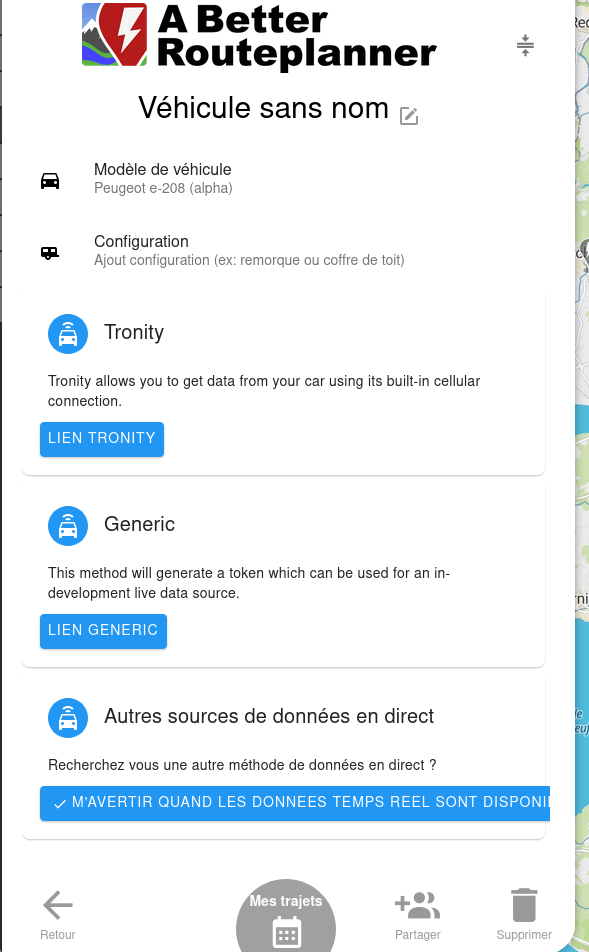

## Connect to A better Route Planner
 Thank's to this you will no longer have to edit manually:
- Exterior temperature
- Autonomy left
- Consumption 

ABRP will optimize your itinerary with these parameters.

### Prerequisite
1. A working last version of psa_car_controller
2. A abetterrouteplanner account

### Procedure
1. Go to [https://abetterrouteplanner.com/](https://abetterrouteplanner.com/)
2. Edit the parameter of your car, you should have something like this:

3. Click on Generic Link
4. Click on copy
5. Open the following url after replacing YOURTOKEN by the value you just copied:
```
http://localhost:5000/abrp?token=YOURTOKEN
```
6. Add the value copied
[model list](https://api.iternio.com/1/tlm/get_carmodels_list?api_key=32b2162f-9599-4647-8139-66e9f9528370)
