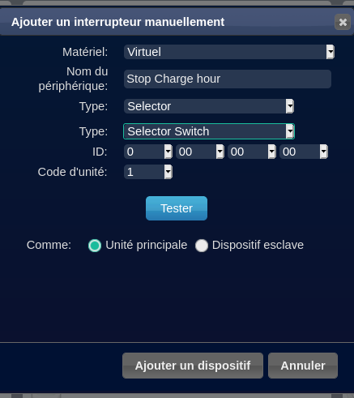
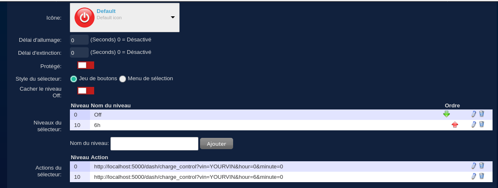
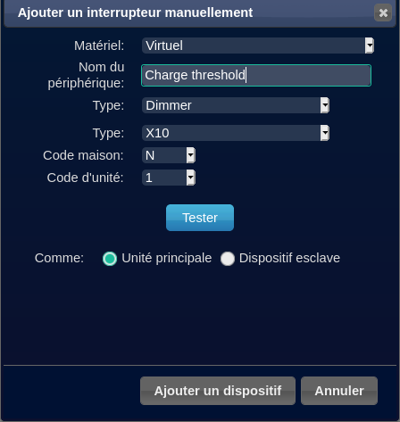
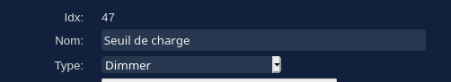
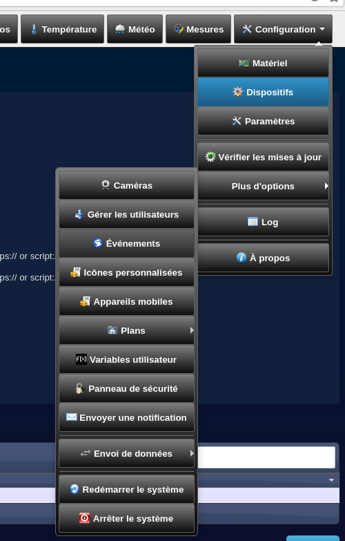
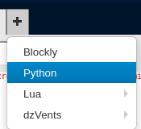

## Connect Domoticz
### I. Add stop hour control
In this example we will add the possibility to stop the charge at 6 o'clock.
1. Add new selector switch:

   
2. Edit it like this

Selector action:
   - http://localhost:5000/dash/charge_control?vin=YOURVIN&hour=0&minute=0
   - http://localhost:5000/dash/charge_control?vin=YOURVIN&hour=6&minute=0
    
3. Save
# II. Add charge threshold control
You can do the same thing that we did in part one. You just have to change url to :
- http://localhost:5000/charge_control?vin=YOURVIN&percentage=100
- http://localhost:5000/charge_control?vin=YOURVIN&percentage=XX

If you want more precise control :
1. Add a virtual switch 


2. Edit the new switch
3. Get the idx 

   
4. Open event configuration : configuration -> devices -> Event

   
5. Add new python script

   
6. Add this code and change the vin in the url
```python
import domoticz
import DomoticzEvents as DE
import urllib.request


for name, value in DE.user_variables.items():
  domoticz.log("var"+ str(name)+ "has value"+ str(value))


domoticz.log("The device that got changed is: "+DE.changed_device_name)
# changed_device.name is the same string
if DE.changed_device_name== "Seuil de charge":
    urllib.request.urlopen('http://localhost:5000/charge_control?vin=YOURVIN&percentage='+str(DE.changed_device.s_value))
```
7. Save
